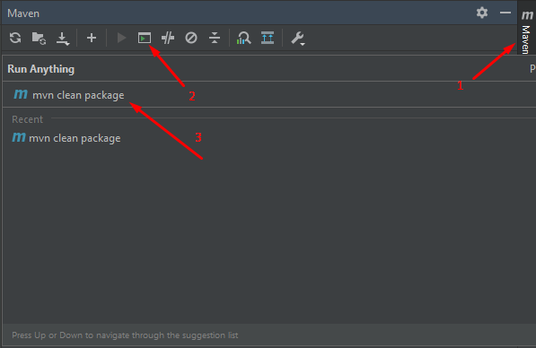
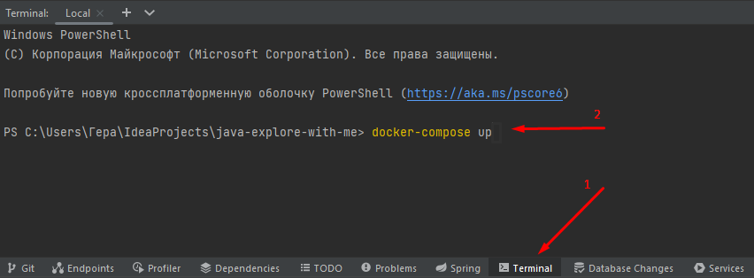

# Explore With Me
Проверь текст на ошибки: Пространство, созданное для поиска единомышленников. 
Тут вы можете размещать события, на которые хотите пригласить всех желающих, 
чтобы они приняли в них участие. Или можете сами принять участие в одном из таких событий. 
Решать вам.

# Для пользователя:
1. Добавление - добавляя собственное событие, вы в праве настроить его под свои нужды: изменять количество участников, модерировать заявки, добавлять координаты, чтобы люди могли быстрее найти вас!
2. Редактирование - редактируйте свою заявку, если у вас поменялись планы.
3. Просмотр - просматривайте самые популярные события и принимайте в них участие.
4. Комментарии - оставляйте свои комментарии после посещения события.
5. Фильтры и подборки - найдите для себя событие, в котором хотели бы принять участие, используя фильтры или просмотр подборок по вашим интересам.

# Инструкция по развёртыванию:
- Java 11+
- Docker
- Перед запуском, программу нужно подготовить: упакуйте проекти используя команду "mvn clean package" как это показано на изображении

- Запустите Docker и зайдите в терминал среды разработки, введите команду "docker-compose up"

- Наслаждаетесь пользованием

# В грядущем обновлении планируется:
- Добавление участника события в черный список
- Подписки на других пользователей
- Оценка (лайк/дизлайк)
- Администрирование локаций